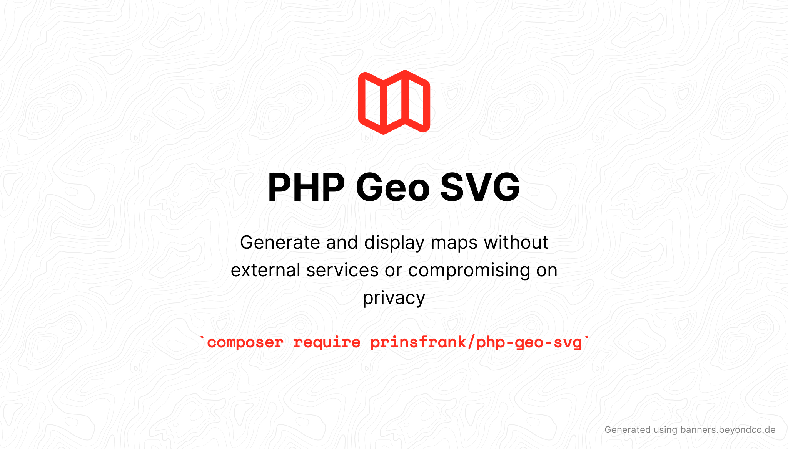

# PHP Geo SVG


[](https://scrutinizer-ci.com/g/PrinsFrank/php-geo-svg/build-status/main)
[](https://scrutinizer-ci.com/g/PrinsFrank/php-geo-svg/?branch=main)
[](https://scrutinizer-ci.com/g/PrinsFrank/php-geo-svg/?branch=main)

**Generate and display maps without external services or compromising on privacy.**

## Why this package?

When searching for high quality SVG's for [my blog](https://prinsfrank.nl/countries), I ran into the issue that all SVG's where either too low quality, heavily polluted with unnecessary elements by the tool they were generated with, or in the wrong projection. This package provides the flexibility to generate maps manually or from geojson files, which are more readily available.

## Features

- Supports creation of SVGs from GeoJSON (directly from file, as a JSON string or from an array) and manual GeometryCollection.
- Output the svg directly to your user on request or output to a file.
- Render an entire world map or only part of it by using a bounding box.
- Easy support for projections. Currently supported: EquiRectangular, Mercator and Miller. Please open a PR to add any extra ones.
- When you create or edit a GeometryCollection, a Fluent Interface is provided to allow for method chaining.

|Showcase|
|:----:|
|Countries - Equirectangular projection <div></div>|
|Netherlands - Mercator projection <div></div>|

## Table of Contents

- [Why this package?](#why-this-package)
- [Features](#features)
- [Table of Contents](#table-of-contents)
- [Setup](#setup)
- [The basics; creating an SVG](#the-basics-creating-an-svg)
  - [From a GeoJSON file](#from-a-geojson-file)
  - [From a GeoJSON string](#from-a-geojson-string)
  - [From a GeoJSON array](#from-a-geojson-array)
  - [From building your own GeometryCollection](#from-building-your-own-geometrycollection)
- [Different globe-to-plane transformations; Projections](#different-globe-to-plane-transformations-projections)
- [Displaying only parts of the world; Using bounding boxes](#displaying-only-parts-of-the-world-using-bounding-boxes)

## Setup

To start right away, run the following command in your composer project;

```composer require prinsfrank/php-geo-svg```

Or for development only;

```composer require prinsfrank/php-geo-svg --dev```

## The basics; creating an SVG

Let's say we want to create the following simple continent map:


There are multiple ways we can go about creating this map in svg using this package;

### From a GeoJSON file

To create an SVG from a GeoJson file, create a new 'GeometryCollection' by calling the 'createFromGeoJSONFilePath' method on the 'GeometryCollectionFactory' as follows;

<details>
    <summary>Show code</summary>

With variables:
```
$geoSVG = new GeoSVG();
$geometryCollection = GeometryCollectionFactory::createFromGeoJSONFilePath('/path/to/file.geojson');
$geoSVG->toFile($geometryCollection, 'output/file.svg');
```

Fluent:
```
(new GeoSVG())
    ->toFile(
        GeometryCollectionFactory::createFromGeoJSONFilePath(__DIR__ . '/path/to/file.geojson'),
        'output/file.svg'
    );
```
</details>

### From a GeoJSON string

To create an SVG from a GeoJson string, create a new 'GeometryCollection' by calling the 'createFromGeoJsonString' method on the 'GeometryCollectionFactory' as follows;

<details>
    <summary>Show code</summary>

With variables:
```
$geoJsonString = '{"type":"FeatureCollection","features":[{"type":"Feature","properties":{"featurecla":"Continent"},"geometry":{"type":"MultiLineString","coordinates":[[[-177,74],[-80,9],[-25,82]]]}},{"type":"Feature","properties":{"featurecla":"Continent"},"geometry":{"type":"MultiLineString","coordinates":[[[-80,9],[-37,-7],[-70,-55]]]}},{"type":"Feature","properties":{"featurecla":"Continent"},"geometry":{"type":"MultiLineString","coordinates":[[[-12,36],[30,37],[27,70],[-24,66]]]}},{"type":"Feature","properties":{"featurecla":"Continent"},"geometry":{"type":"MultiLineString","coordinates":[[[-12,36],[30,37],[51,11],[22,-35],[-17,17]]]}},{"type":"Feature","properties":{"featurecla":"Continent"},"geometry":{"type":"MultiLineString","coordinates":[[[27,70],[30,37],[51,11],[131,-2],[171,67]]]}},{"type":"Feature","properties":{"featurecla":"Continent"},"geometry":{"type":"MultiLineString","coordinates":[[[115,-15],[153,-15],[148,-43],[114,-35]]]}}]}';


$geoSVG = new GeoSVG();
$geometryCollection = GeometryCollectionFactory::createFromGeoJsonString($geoJsonString);
$geoSVG->toFile($geometryCollection, 'output/file.svg');
```

Fluent:
```
$geoJsonString = '{"type":"FeatureCollection","features":[{"type":"Feature","properties":{"featurecla":"Continent"},"geometry":{"type":"MultiLineString","coordinates":[[[-177,74],[-80,9],[-25,82]]]}},{"type":"Feature","properties":{"featurecla":"Continent"},"geometry":{"type":"MultiLineString","coordinates":[[[-80,9],[-37,-7],[-70,-55]]]}},{"type":"Feature","properties":{"featurecla":"Continent"},"geometry":{"type":"MultiLineString","coordinates":[[[-12,36],[30,37],[27,70],[-24,66]]]}},{"type":"Feature","properties":{"featurecla":"Continent"},"geometry":{"type":"MultiLineString","coordinates":[[[-12,36],[30,37],[51,11],[22,-35],[-17,17]]]}},{"type":"Feature","properties":{"featurecla":"Continent"},"geometry":{"type":"MultiLineString","coordinates":[[[27,70],[30,37],[51,11],[131,-2],[171,67]]]}},{"type":"Feature","properties":{"featurecla":"Continent"},"geometry":{"type":"MultiLineString","coordinates":[[[115,-15],[153,-15],[148,-43],[114,-35]]]}}]}';

(new GeoSVG())
    ->toFile(
        GeometryCollectionFactory::createFromGeoJsonString($geoJsonString),
        'output/file.svg'
    );
```
</details>

### From a GeoJSON array

To create an SVG from a GeoJson array, create a new 'GeometryCollection' by calling the 'createFromGeoJSONArray' method on the 'GeometryCollectionFactory' as follows;

<details>
    <summary>Show code</summary>

With variables:
```
$geoJsonArray = ['type'=>'FeatureCollection','features'=>[['type'=>'Feature','properties'=>['featurecla'=>'Continent'],'geometry'=>['type'=>'MultiLineString','coordinates'=>[[[-177,74],[-80,9],[-25,82]]]]],['type'=>'Feature','properties'=>['featurecla'=>'Continent'],'geometry'=>['type'=>'MultiLineString','coordinates'=>[[[-80,9],[-37,-7],[-70,-55]]]]],['type'=>'Feature','properties'=>['featurecla'=>'Continent'],'geometry'=>['type'=>'MultiLineString','coordinates'=>[[[-12,36],[30,37],[27,70],[-24,66]]]]],['type'=>'Feature','properties'=>['featurecla'=>'Continent'],'geometry'=>['type'=>'MultiLineString','coordinates'=>[[[-12,36],[30,37],[51,11],[22,-35],[-17,17]]]]],['type'=>'Feature','properties'=>['featurecla'=>'Continent'],'geometry'=>['type'=>'MultiLineString','coordinates'=>[[[27,70],[30,37],[51,11],[131,-2],[171,67]]]]],['type'=>'Feature','properties'=>['featurecla'=>'Continent'],'geometry'=>['type'=>'MultiLineString','coordinates'=>[[[115,-15],[153,-15],[148,-43],[114,-35]]]]]]];


$geoSVG = new GeoSVG();
$geometryCollection = GeometryCollectionFactory::createFromGeoJsonArray($geoJsonArray);
$geoSVG->toFile($geometryCollection, 'output/file.svg');
```

Fluent:
```
$geoJsonArray = ['type'=>'FeatureCollection','features'=>[['type'=>'Feature','properties'=>['featurecla'=>'Continent'],'geometry'=>['type'=>'MultiLineString','coordinates'=>[[[-177,74],[-80,9],[-25,82]]]]],['type'=>'Feature','properties'=>['featurecla'=>'Continent'],'geometry'=>['type'=>'MultiLineString','coordinates'=>[[[-80,9],[-37,-7],[-70,-55]]]]],['type'=>'Feature','properties'=>['featurecla'=>'Continent'],'geometry'=>['type'=>'MultiLineString','coordinates'=>[[[-12,36],[30,37],[27,70],[-24,66]]]]],['type'=>'Feature','properties'=>['featurecla'=>'Continent'],'geometry'=>['type'=>'MultiLineString','coordinates'=>[[[-12,36],[30,37],[51,11],[22,-35],[-17,17]]]]],['type'=>'Feature','properties'=>['featurecla'=>'Continent'],'geometry'=>['type'=>'MultiLineString','coordinates'=>[[[27,70],[30,37],[51,11],[131,-2],[171,67]]]]],['type'=>'Feature','properties'=>['featurecla'=>'Continent'],'geometry'=>['type'=>'MultiLineString','coordinates'=>[[[115,-15],[153,-15],[148,-43],[114,-35]]]]]]];

(new GeoSVG())
    ->toFile(
        GeometryCollectionFactory::createFromGeoJsonArray($geoJsonArray),
        'output/file.svg'
    );
```
</details>

### From building your own GeometryCollection

To build an SVG manually from a GeometryCollection, create the object and add any geometry you want:


<details>
    <summary>Show code</summary>

With variables:
```
$geoSVG = new GeoSVG();
$geometryCollection = new GeometryCollection();

$continents = new MultiPolygon();
$geometryCollection->addGeometryObject($continents);

$outerBorderNorthAmerica = new LineString();
$outerBorderNorthAmerica->addPosition(new Position(-177, 74));
$outerBorderNorthAmerica->addPosition(new Position(-80, 9));
$outerBorderNorthAmerica->addPosition(new Position(-25, 82));
$outerBorderNorthAmerica->setFeatureClass('Continent');
$outerBorderNorthAmerica->setTitle('North America');
$polygonNorthAmerica = new Polygon($outerBorderNorthAmerica);
$continents->addPolygon($polygonNorthAmerica);


$outerBorderSouthAmerica = new LineString();
$outerBorderSouthAmerica->addPosition(new Position(-80, 9));
$outerBorderSouthAmerica->addPosition(new Position(-37, -7));
$outerBorderSouthAmerica->addPosition(new Position(-70, -55));
$outerBorderSouthAmerica->setFeatureClass('Continent');
$outerBorderSouthAmerica->setTitle('South America');
$polygonSouthAmerica = new Polygon($outerBorderSouthAmerica);
$continents->addPolygon($polygonSouthAmerica);

$outerBorderEurope = new LineString();
$outerBorderEurope->addPosition(new Position(-12, 36));
$outerBorderEurope->addPosition(new Position(30, 37));
$outerBorderEurope->addPosition(new Position(27, 70));
$outerBorderEurope->addPosition(new Position(-24, 66));
$outerBorderEurope->setFeatureClass('Continent');
$outerBorderEurope->setTitle('Europe');
$polygonEurope = new Polygon($outerBorderEurope);
$continents->addPolygon($polygonEurope);

$outerBorderAfrica = new LineString();
$outerBorderAfrica->addPosition(new Position(-12, 36));
$outerBorderAfrica->addPosition(new Position(30, 37));
$outerBorderAfrica->addPosition(new Position(51, 11));
$outerBorderAfrica->addPosition(new Position(22, -35));
$outerBorderAfrica->addPosition(new Position(-17, 17));
$outerBorderAfrica->setFeatureClass('Continent');
$outerBorderAfrica->setTitle('Africa');
$polygonAfrica = new Polygon($outerBorderAfrica);
$continents->addPolygon($polygonAfrica);

$outerBorderAsia = new LineString();
$outerBorderAsia->addPosition(new Position(27, 70));
$outerBorderAsia->addPosition(new Position(30, 37));
$outerBorderAsia->addPosition(new Position(51, 11));
$outerBorderAsia->addPosition(new Position(131, -2));
$outerBorderAsia->addPosition(new Position(171, 67));
$outerBorderAsia->setFeatureClass('Continent');
$outerBorderAsia->setTitle('Asia');
$polygonAsia = new Polygon($outerBorderAsia);
$continents->addPolygon($polygonAsia);

$outerBorderAustralia = new LineString();
$outerBorderAustralia->addPosition(new Position(115, -15));
$outerBorderAustralia->addPosition(new Position(153, -15));
$outerBorderAustralia->addPosition(new Position(148, -43));
$outerBorderAustralia->addPosition(new Position(114, -35));
$outerBorderAustralia->setFeatureClass('Continent');
$outerBorderAustralia->setTitle('Australia');
$polygonAustralia = new Polygon($outerBorderAustralia);
$continents->addPolygon($polygonAustralia);

$geoSVG->toFile($geometryCollection, 'output/file.svg');
```

Fluent:
```
(new GeoSVG())
    ->toFile(
        (new GeometryCollection())
            ->addGeometryObject(
                (new MultiPolygon())
                    ->addPolygon(
                        new Polygon(
                            (new LineString())
                                ->addPosition(new Position(-177, 74))
                                ->addPosition(new Position(-80, 9))
                                ->addPosition(new Position(-25, 82))
                                ->setFeatureClass('Continent')
                                ->setTitle('North America')
                        )
                    )
                    ->addPolygon(
                        new Polygon(
                            (new LineString())
                                ->addPosition(new Position(-80, 9))
                                ->addPosition(new Position(-37, -7))
                                ->addPosition(new Position(-70, -55))
                                ->setFeatureClass('Continent')
                                ->setTitle('South America')
                        )
                    )
                    ->addPolygon(
                        new Polygon(
                            (new LineString())
                                ->addPosition(new Position(-12, 36))
                                ->addPosition(new Position(30, 37))
                                ->addPosition(new Position(27, 70))
                                ->addPosition(new Position(-24, 66))
                                ->setFeatureClass('Continent')
                                ->setTitle('Europe')
                        )
                    )
                    ->addPolygon(
                        new Polygon(
                            (new LineString())
                                ->addPosition(new Position(-12, 36))
                                ->addPosition(new Position(30, 37))
                                ->addPosition(new Position(51, 11))
                                ->addPosition(new Position(22, -35))
                                ->addPosition(new Position(-17, 17))
                                ->setFeatureClass('Continent')
                                ->setTitle('Africa')
                        )
                    )
                    ->addPolygon(
                        new Polygon(
                            (new LineString())
                                ->addPosition(new Position(27, 70))
                                ->addPosition(new Position(30, 37))
                                ->addPosition(new Position(51, 11))
                                ->addPosition(new Position(131, -2))
                                ->addPosition(new Position(171, 67))
                                ->setFeatureClass('Continent')
                                ->setTitle('Asia')
                        )
                    )
                    ->addPolygon(
                        new Polygon(
                            (new LineString())
                                ->addPosition(new Position(115, -15))
                                ->addPosition(new Position(153, -15))
                                ->addPosition(new Position(148, -43))
                                ->addPosition(new Position(114, -35))
                                ->setFeatureClass('Continent')
                                ->setTitle('Australia')
                        )
                    )
            ),
        'output/file.svg'
    );
```
</details>

## Different globe-to-plane transformations; Projections

If you prefer a different projection other than the default EquiRectangular, you can! Currently, the following projections are supported, but please feel free to add any and open a PR;
- Equirectangular
- Mercator
- Miller

To specify the projection you want to use, you can do so either using the constructor;

```
$geoSVG = new GeoSVG(new MercatorProjection);
```

Or using the 'setProjection' method;

```
$geoSVG = new GeoSVG();
$geoSVG->setProjection(new MercatorProjection);
```

## Displaying only parts of the world; Using bounding boxes

If you want to use a bounding box, you have to know both the most southWestern and northEastern coordinates you want to show, and create 'BoundingBoxPositions' for both of them. Pass those along to a bounding box object and you have yourself a bounding box;

```
$northEastern = new BoundingBoxPosition(7.2, 53.5);
$southWestern = new BoundingBoxPosition(3.5, 50.8);

$boundingBox  = new BoundingBox($southWestern, $northEastern);
```

To actually use it, either pass the bounding box in the constructor after the projection;

```
$geoSVG = new GeoSVG($projection, $boundingBox);
```

Or set the bounding box using the 'setBoundingBox' method;

```
$geoSVG = new GeoSVG();
$geoSVG->setBoundingBox($boundingBox);
```
